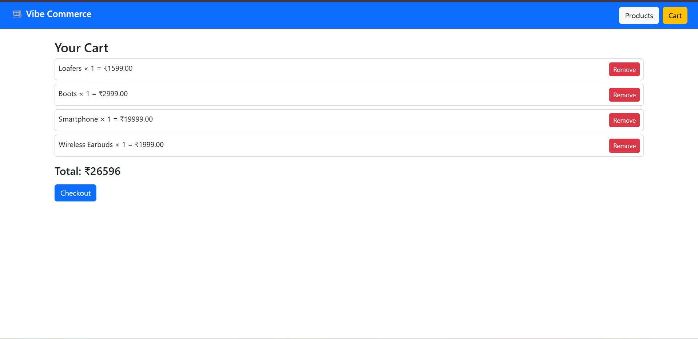

# 🛒 Vibe Commerce – Mock E-Commerce Cart (Full Stack Assignment)

A full-stack shopping cart built for the Vibe Commerce internship assignment.  
Supports product listing, cart management, totals, and mock checkout with receipt.

## ✅ Tech Stack

- **Frontend:** React, Axios, Bootstrap, React Router
- **Backend:** Node.js, Express.js
- **Database:** MySQL (Persistent storage)
- **Bonus Features:** Error handling, Fake Store API toggle

## ✅ Features

✔ Product listing with images  
✔ Add to Cart  
✔ Remove from Cart  
✔ Cart page with auto total  
✔ Checkout → receipt + timestamp  
✔ Responsive mobile-friendly UI  
✔ MySQL data persistence (cart + products)  
✔ Fake Store API mode available

## ✅ Folder Structure

/backend
 ├─ server.js
 ├─ db.js
 └─ routes/

/frontend
 ├─ src/
 ├─ public/images/
 └─ package.json

## ✅ How to Run

### ✅ 1️⃣ Start Backend
cd backend
npm install
node server.js

Backend runs at:
http://localhost:5000

### ✅ 2️⃣ Start Frontend
cd frontend
npm install
npm start

Frontend runs at:
http://localhost:3000

## ✅ REST API Endpoints

| Method | Route | Description |
|--------|-------|-------------|
| GET | `/api/products` | Get all products |
| POST | `/api/cart` | Add to cart |
| GET | `/api/cart` | View cart + total |
| DELETE | `/api/cart/:id` | Remove a cart item |
| POST | `/api/checkout` | Checkout and get receipt |

## ✅ cURL Testing Examples

### ✅ Get Products
curl http://localhost:5000/api/products

### ✅ Add to Cart
curl -X POST http://localhost:5000/api/cart \
  -H "Content-Type: application/json" \
  -d "{\"productId\": 1, \"qty\": 2}"

### ✅ View Cart
curl http://localhost:5000/api/cart

### ✅ Remove From Cart
curl -X DELETE http://localhost:5000/api/cart/1

### ✅ Checkout
curl -X POST http://localhost:5000/api/checkout

## ✅ Database Schema (MySQL)

products(
  id INT PRIMARY KEY AUTO_INCREMENT,
  name VARCHAR(100),
  price DECIMAL(10,2),
  imageFile VARCHAR(100)
)

cart(
  id INT PRIMARY KEY AUTO_INCREMENT,
  productId INT,
  qty INT,
  FOREIGN KEY(productId) REFERENCES products(id)
)

## ✅ Bonus: Fake Store API Mode

FAKE_API=true

Then `/api/products` will return data from:
https://fakestoreapi.com/products

## 📸 Project Screenshots

### 🛍️ Product Page

### 🛒 Cart Page

### ✅ Checkout Page

## 📽️ Demo Video
(Insert Loom / YouTube unlisted link here)

## 👤 Author

Name: Rajesh Parikapalli  
Email: parikapallirajeshgoud@gmail.com  
GitHub: https://github.com/rajesh270627
